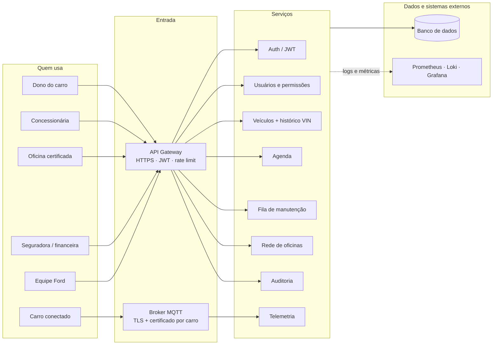

# Ford Nexus API

> A Ford não precisa trazer o cliente de volta para a loja. Precisa chegar onde ele já está.

Este repositório é a API do **Ford Nexus**, o projeto que o nosso grupo desenvolveu para o Desafio Ford × FIAP (Engenharia de Software).

---

## Por que isso existe

Quando a Ford parou de fabricar carros no Brasil, em 2021, a rede de concessionárias encolheu de 283 para cerca de 120 lojas. Só que os carros continuaram rodando: são mais de 3,8 milhões de Fords nas ruas, com idade média de 11 anos.

Pense no dono de um Ka 2016 em Sorocaba. Ele não saiu da rede Ford porque quis. Saiu porque a loja onde fazia revisão fechou, e a mais próxima ficou longe e cara demais. Ele passou a ir na oficina da esquina, e a Ford perdeu o contato com ele e com o carro.

A nossa aposta é que o problema não é de aplicativo, é de **cobertura**. Por isso o Ford Nexus não é mais um app para instalar. É uma camada que faz três coisas:

| Fase | O que faz | Para quem |
|---|---|---|
| **V1 —> Agenda inteligente** | Descobre quem está na hora da revisão (pela quilometragem e pela data do último serviço), conversa com o cliente pelo WhatsApp e ocupa a agenda da oficina | Concessionárias |
| **V2 —> Ford Service Partner** | Certifica oficinas independentes nos bairros onde a concessionária fechou: peça genuína, checklist, preço tabelado e garantia da marca | Oficinas da região |
| **V3 —> Histórico por VIN** | Cada serviço vira um registro no chassi do carro. Esse histórico verificado vale dinheiro na revenda, no seguro e no financiamento | Seguradoras, financeiras, revendas |

Esta API é o coração das três fases: guarda os veículos e o histórico, monta a fila de quem precisa de revisão, controla a agenda, gerencia a rede de oficinas certificadas e recebe a telemetria dos carros conectados.

---

## O que a API faz, na prática

Um dia normal de uso, contado do jeito que ele acontece:

1. **De manhã, a concessionária abre a fila do dia.** A API cruza a quilometragem atual de cada carro da carteira com o último serviço registrado e devolve quem está vencido (10.000 km ou 12 meses), do mais urgente para o menos urgente. Só entra quem autorizou contato; quem já tem horário marcado fica de fora.
2. **Alguém liga (ou, no futuro, o bot manda mensagem) e marca o horário.** O agendamento passa por um ciclo simples: agendado → confirmado → concluído, e pode ser cancelado ou marcado como "não compareceu". A API não deixa marcar dois carros no mesmo horário nem o mesmo carro duas vezes.
3. **O serviço é feito**, na concessionária ou numa oficina certificada. A ordem de serviço vai para o histórico do carro. Oficina que ainda não foi certificada não consegue registrar nada.
4. **O carro conectado manda a quilometragem sozinho** pelo MQTT. Se a leitura for estranha (hodômetro voltando, salto de milhares de km de uma vez), a API recusa e registra um alerta de possível adulteração.
5. **Uma seguradora consulta o histórico do carro** antes de fazer a apólice. Ela só vê se o dono autorizou o compartilhamento, e mesmo assim recebe só o histórico técnico: nada de nome ou telefone.

Por trás disso tudo tem autenticação, perfis de acesso, criptografia de dados pessoais, trilha de auditoria e monitoramento. Esses detalhes estão mais abaixo.

---

## Arquitetura

A solução é organizada em **serviços**, cada um com uma responsabilidade clara e um contrato próprio (REST/JSON, versionado em `/api/v1`, documentado em OpenAPI). Tudo o que vem de fora passa por um ponto único de entrada: o gateway, para as requisições HTTP, ou o broker MQTT, para os carros.



Hoje os oito serviços rodam num único processo (um monólito modular), mas cada um tem fronteira e contrato próprios. Dá para separar qualquer um deles e colocar para rodar sozinho sem mudar a forma como os outros conversam com ele.

Dentro do código, o projeto segue camadas, com as dependências sempre apontando para dentro:

| Projeto | O que tem lá |
|---|---|
| `FordNexus.Domain` | As entidades (Veículo, Ordem de Serviço, Agendamento, Oficina, Concessionária, Usuário) e as regras que são delas: formato do VIN, transições de status, certificação |
| `FordNexus.Application` | Os casos de uso: toda regra de negócio, validação de entrada, escopo por concessionária, consentimentos da LGPD, auditoria e validação de telemetria |
| `FordNexus.Infrastructure` | O que fala com o mundo: banco de dado (EF Core), geração de JWT, criptografia, hash de senha, cliente MQTT e métricas |
| `FordNexus.Api` | Os controllers, a autenticação, as políticas de acesso, o tratamento de erros, os logs e o Swagger |
| `FordNexus.Api.Tests` | Testes de integração que sobem a API de verdade em memória e fazem chamadas HTTP |

**Tecnologias:** .NET 8, ASP.NET Core, Entity Framework Core (InMemmory), JWT, MQTTnet, prometheus-net, Swashbuckle (Swagger), xUnit. No ambiente Docker: Mosquitto, Prometheus, Loki, Promtail e Grafana.

---

## Como rodar

Tem dois jeitos. O primeiro é o mais rápido e serve para usar e testar a API. O segundo sobe o ambiente completo, com MQTT e monitoramento.

### Pré-requisitos

- [.NET SDK 8](https://dotnet.microsoft.com/download/dotnet/8.0). Para conferir: `dotnet --version` deve mostrar `8.0.x`.
- Para o ambiente completo: [Docker Desktop](https://www.docker.com/products/docker-desktop/) instalado e aberto.
- Não precisa instalar banco de dados. A API usa um banco em memória que já sobe com dados de exemplo.

### Opção 1 ( Só a API +/- 2 minutos)

Na raiz do repositório:

```bash
dotnet restore
dotnet run --project src/FordNexus.Api
```

Quando aparecer `Now listening on: http://localhost:5080`, abra **http://localhost:5080/swagger**.

Algumas coisas que é bom saber:

- **Não precisa configurar chave nenhuma para rodar local.** Em desenvolvimento, a API gera uma chave temporária para o JWT e outra para a criptografia toda vez que sobe. O lado ruim é que, se você reiniciar a API, os tokens antigos deixam de valer e é só fazer login de novo.
- **Os dados voltam ao estado inicial a cada reinício**, porque o banco é em memória.
- Se quiser uma chave fixa localmente (para não perder o token ao reiniciar):
  ```bash
  dotnet user-secrets set "Jwt:SigningKey" "uma-chave-bem-grande-com-pelo-menos-32-caracteres" --project src/FordNexus.Api
  ```

### Opção 2: Ambiente completo com Docker (API + MQTT + monitoramento)

No Windows, com o Docker Desktop aberto, em um PowerShell na raiz do repositório:

```powershell
.\scripts\subir-ambiente.ps1
```

Esse script faz três coisas:

1. Cria um arquivo `.env` com chaves aleatórias para o JWT, para a criptografia e para a senha do Grafana. Esse arquivo fica só na sua máquina e não vai para o Git.
2. Gera os certificados do MQTT: uma autoridade certificadora própria, o certificado do broker, o da API e um para cada carro de exemplo.
3. Sobe tudo com `docker compose`.

Quando terminar:

| O quê | Onde |
|---|---|
| API | http://localhost:8080/health |
| Grafana (dashboards) | http://localhost:3000 | usuário `admin`, senha no arquivo `.env` |
| Prometheus (alertas) | http://localhost:9090/alerts |
| Broker MQTT | `localhost:8883`, só com TLS e certificado de cliente |

No Docker a API roda em modo **produção**, então o Swagger fica desligado (de propósito). Para explorar os endpoints pelo Swagger, use a opção 1.

Depois de subir, dá para gerar movimento para ver os dashboards e os alertas funcionando:

```powershell
.\scripts\gerar-trafego.ps1        # uso normal + alguns ataques simulados (força bruta, acesso indevido)
.\scripts\simular-telemetria.ps1   # carros mandando quilometragem, inclusive leituras adulteradas
```

Para parar tudo: `docker compose down`.

> Se o PowerShell reclamar de permissão para rodar scripts, rode antes, na mesma janela: `Set-ExecutionPolicy -Scope Process Bypass`.

### Rodando os testes

```bash
dotnet test
```

São 110 casos de teste de integração: cada um sobe a API em memória e faz chamadas HTTP reais, passando por autenticação, perfis, regras de negócio e banco. Eles cobrem os caminhos felizes, os erros (400, 404, 409, 422) e as tentativas de acesso indevido (401, 403, 429).

Para gerar um relatório em HTML, útil como evidência:

```powershell
.\scripts\run-tests.ps1     # no Windows
./scripts/run-tests.sh      # no Linux/macOS/Git Bash
```

O relatório fica em `TestResults/test-results.html`.

---

## Testando na mão: um roteiro de 5 minutos

Com a API rodando pela opção 1 e o Swagger aberto:

**1. Entre como concessionária.** Em `POST /api/v1/auth/login`, envie:
```json
{ "email": "concessionaria@fordnexus.com", "password": "Dealer@123" }
```
Copie o `accessToken` da resposta, clique em **Authorize** (cadeado no topo) e cole.

**2. Veja quem está na hora da revisão.** Chame `GET /api/v1/dealerships/11111111-1111-1111-1111-111111111111/maintenance-queue`. Deve aparecer o **Ka 2016** (14 meses sem revisão) e o **EcoSport** (11.500 km rodados desde a última). A Ranger está em dia e o Fiesta não autorizou contato, então nenhum dos dois entra.

**3. Marque o horário do Ka.** Em `POST /api/v1/appointments`:
```json
{ "vin": "9BFZH55L0G8123456", "serviceType": "Revision", "scheduledAt": "2027-01-12T09:00:00-03:00" }
```
Resposta **201**. Tente mandar de novo: agora vem **409**, porque o carro já tem horário.

**4. Confirme.** `PATCH /api/v1/appointments/{id}` com `{ "status": "Confirmed" }` → **200**. Se você chamar a fila de novo, o Ka não aparece mais.

**5. Veja pelo lado da seguradora.** Faça login com `seguradora@fordnexus.com` / `Parceiro@123` e chame `GET /api/v1/vehicles/9BFZH55L0G8123456/history`: vem o histórico, sem nome nem telefone. Agora tente o Fiesta (`9BFZF26P3E8135790`): **403**, porque o dono não autorizou o compartilhamento.

### Usuários de demonstração

| Perfil | E-mail | Senha | O que enxerga |
|---|---|---|---|
| Admin (Ford) | `admin@fordnexus.com` | `Admin@123` | Tudo |
| Concessionária de Sorocaba | `concessionaria@fordnexus.com` | `Dealer@123` | A própria carteira, agenda e fila |
| Concessionária de Campinas | `campinas@fordnexus.com` | `Dealer@123` | Idem, de Campinas |
| Oficina certificada | `oficina@fordnexus.com` | `Oficina@123` | A própria agenda; registra serviços |
| Oficina ainda não certificada | `oficina.pendente@fordnexus.com` | `Oficina@123` | Não consegue registrar serviço |
| Seguradora (parceiro) | `seguradora@fordnexus.com` | `Parceiro@123` | Só histórico por VIN, com consentimento |

Essas senhas existem só nos dados de exemplo. Usuários novos, criados pela API, precisam de uma senha com pelo menos 12 caracteres.

### Carros de exemplo

| VIN | Carro | Situação |
|---|---|---|
| `9BFZH55L0G8123456` | Ka SE 2016 | Atrasado na revisão · manda telemetria |
| `9BFZB55P7K8765432` | EcoSport 2019 | Rodou muito desde a última · manda telemetria · não compartilha histórico |
| `8AFAR23L5NJ246810` | Ranger 2022 | Em dia |
| `9BFZF26P3E8135790` | Fiesta 2014 | Não autorizou contato nem compartilhamento |
| `9BFZH54S8J8975310` | Ka Sedan 2018 | Carteira de Campinas |

---

## Endpoints

Todos começam com `/api/v1`. A documentação completa, com exemplos, está no Swagger.

| Recurso | Principais operações | Quem acessa |
|---|---|---|
| `auth` | `POST /login` · `GET /me` | Login é público; `/me`, qualquer usuário logado |
| `users` | listar, detalhar, criar · `GET /permissions-report` | Admin |
| `vehicles` | listar, detalhar, criar, atualizar, excluir | Admin e concessionária (exclusão só Admin) |
| `vehicles/{vin}/history` | histórico verificado do chassi | Todos os perfis; parceiro só com consentimento |
| `vehicles/{vin}/service-orders` | registrar e consultar ordens de serviço | Concessionária e oficina certificada |
| `appointments` | listar, criar, remarcar (`PUT`), mudar status (`PATCH`), excluir | Admin, concessionária e oficina, cada um na própria agenda |
| `workshops` | listar e detalhar (público, só certificadas) · cadastrar e certificar | Público / Admin |
| `dealerships` | listar, detalhar · `GET /{id}/maintenance-queue` | Admin e concessionária (só a própria fila) |
| `audit-events` | trilha de auditoria | Admin |

Toda resposta de erro segue o mesmo formato (`application/problem+json`), com um `code` estável e um `traceId` para achar o log correspondente:

```json
{
  "status": 409,
  "title": "Conflito com o estado atual do recurso",
  "detail": "Este veículo já possui um agendamento ativo.",
  "code": "conflict",
  "traceId": "00-4bf92f3577b34da6a3ce929d0e0e4736-00f067aa0ba902b7-01"
}
```

---

## Segurança, em poucas palavras

A gente levou segurança a sério porque o sistema guarda dado pessoal de milhões de donos de carro e um histórico que vale dinheiro. O resumo do que foi feito:

- **Login protegido:** no máximo 5 tentativas por minuto por IP, e a conta é bloqueada por 15 minutos depois de 5 senhas erradas. A mensagem de erro é sempre a mesma, para ninguém descobrir quais e-mails existem.
- **Token JWT de 30 minutos**, assinado com uma chave que nunca fica no código. Em produção, sem chave configurada, a API nem sobe.
- **Cada um só vê o que é seu:** uma concessionária não enxerga clientes, agenda ou fila de outra, mesmo que tente mandar o ID dela na requisição.
- **Nome e telefone do dono são gravados criptografados** (AES-256-GCM). Senhas usam hash (PBKDF2).
- **Consentimento separado por finalidade:** contato pelo WhatsApp, compartilhamento com parceiros e telemetria. Sem o consentimento, o dado não é usado.
- **Telemetria segura:** o carro só conecta no broker com certificado próprio, e só consegue publicar no tópico do próprio VIN.
- **Pipeline DevSecOps no GitHub Actions:** a cada PR, rodam os testes, a busca por segredos (Gitleaks), a análise de código (Semgrep e CodeQL), a verificação de dependências vulneráveis, a análise do Dockerfile e da imagem (Trivy) e um teste dinâmico (OWASP ZAP). Achado grave bloqueia o merge.
- **Container endurecido:** imagem mínima, sem shell, rodando sem privilégio de administrador, com sistema de arquivos somente leitura.

---

## Monitoramento

Com o ambiente Docker no ar, você tem:

- **Logs em JSON** com um evento por acontecimento importante (`auth.login.failed`, `auth.lockout`, `authz.scope_denied`, `telemetry.rejected`…), sem dado pessoal: o e-mail vira uma "impressão digital" e o VIN aparece mascarado.
- **Trilha de auditoria** das ações sensíveis, como excluir um veículo, mudar um consentimento, certificar uma oficina e entregar um histórico para uma seguradora: quem fez, quando e de onde.
- **Métricas e alertas no Prometheus**: API fora do ar, taxa de erro, suspeita de força bruta, conta bloqueada, tentativa de acesso a dados de outra loja, broker MQTT desconectado e telemetria adulterada.
- **Um dashboard no Grafana** ("Ford Nexus, Segurança e Operação") já configurado, com a visão geral da API, a parte de segurança, o IoT e os logs.

---

## Estrutura de pastas

```
.
├── src/
│   ├── FordNexus.Domain/          entidades e regras do domínio
│   ├── FordNexus.Application/     casos de uso, contratos, regras de negócio
│   ├── FordNexus.Infrastructure/  banco, JWT, criptografia, MQTT, métricas
│   └── FordNexus.Api/             controllers, autenticação, erros, Swagger
├── tests/
│   └── FordNexus.Api.Tests/       testes de integração
├── deploy/
│   ├── k8s/                       manifests Kubernetes (namespace, deployment, network policy, ingress)
│   ├── mqtt/                      configuração do broker, ACL e script de certificados
│   └── observability/             Prometheus, alertas, Promtail e dashboard do Grafana
├── scripts/                       subir ambiente, gerar tráfego, simular telemetria, rodar testes
├── .github/                       pipeline DevSecOps e Dependabot
├── Dockerfile
└── docker-compose.yml
```

---

## Quando algo dá errado

| Sintoma | O que fazer |
|---|---|
| `Address already in use` na porta 5080 ou 8080 | Outra coisa está usando a porta. Feche o outro processo ou mude a porta em `src/FordNexus.Api/Properties/launchSettings.json` |
| 401 em tudo depois de reiniciar a API | Normal na opção 1: a chave temporária mudou. Faça login de novo |
| 429 no login | Você passou de 5 tentativas em 1 minuto. Espere o tempo indicado no header `Retry-After` |
| Login certo retorna 401 | A conta pode estar bloqueada por 15 minutos depois de 5 senhas erradas. Espere ou reinicie a API (opção 1) |
| `docker compose` reclama de `JWT_SIGNING_KEY` | Falta o `.env`. Rode `.\scripts\subir-ambiente.ps1`, que cria o arquivo |
| Broker MQTT não sobe, erro estranho de arquivo | Provavelmente o Git converteu os arquivos de `deploy/mqtt` para quebra de linha do Windows. O `.gitattributes` já evita isso em clones novos; se acontecer, clone o repositório de novo |
| Script `.ps1` bloqueado | `Set-ExecutionPolicy -Scope Process Bypass` na mesma janela do PowerShell |
| Dashboard do Grafana vazio | Rode `.\scripts\gerar-trafego.ps1` e espere uns 30 segundos |

---

## Integrantes

| Nome | RM 
|---|---|
| Ana Clara Melo | RM559021 
| David Murillo de Oliveira Soares | RM559078 
| Lucas Serrano | RM555170
| Yasmim Gonçalves | RM559147 

Desafio Ford & FIAP · ESPY · 2026
